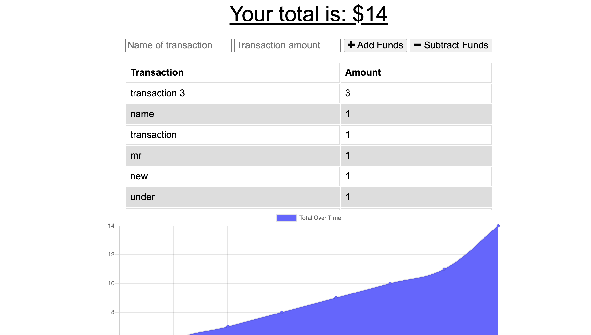

# PWA-Budget-Tracker

## Description 
Budget tracker is an application that will allow the user to add or subtract expenses and deposits to their budget both online and offline. If transactions are entered offline, the changes will be shown when the application goes back online. IndexDB, Service workers, and Web Manifest are all used for offline functionality and the application is deployed on Heroku. (Note: Heroku application is now fully functional, however has errors. For some reason I had to create a brand new heroku app for it to work)

## Table of Contents
* [Installation](#installation)
* [Usage](#usage)
* [License](#license)
* [Contributors](#contributors)
* [Tests](#tests)
* [Questions](#questions)

## Installation 
In order to install, clone the repository from GitHub and install dependencies using npm install. To run the server, run `npm start` from the command line. 

## Usage 
This application will allow users to track transactions such as deposits or withdrawals, with or without internet connection.  
Deployed application on [Heroku](https://stark-everglades-55642.herokuapp.com/) 

## License 
This project is licensed under ISC

## Contributors 
Ethan Fregien

## Tests
There are no tests for this application. 

## Questions
https://github.com/ethanfregien2233
ethanfregien@gmail.com
